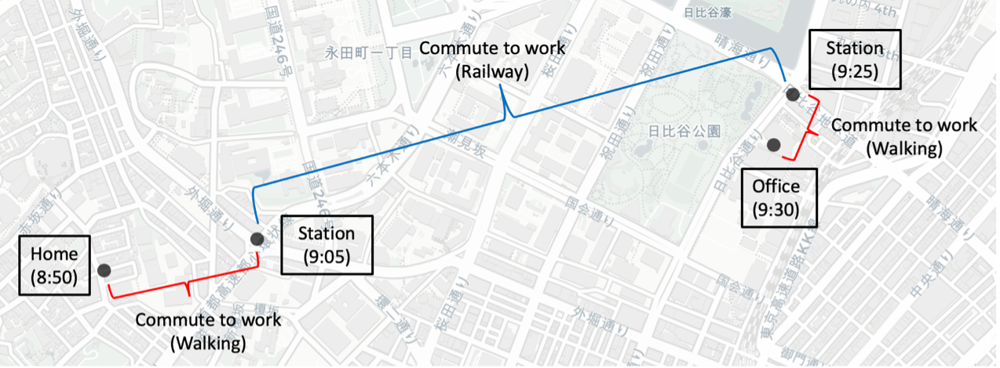

# Trip-purpose-based Methods for Predicting Human Mobility’s Next Location  
**Author:** Jeng-Yue Liu  

---

## Abstract  
This study presents an innovative approach to predicting human mobility’s next location, enhancing traditional methodologies with a focus on the shifts in trip purposes within time-series analysis. By integrating static background information, such as sociodemographic data, with geographic land use characteristics, the model effectively differentiates mobility behavior patterns among diverse demographic groups. This integration allows for the accurate capturing of dynamic changes in mobility while preserving the integrity of individual’s background information. The development of a low-complexity hybrid model, which processes both static and dynamic features, further improves the accuracy and adaptability of predictions across various geographical areas.

Employing advanced GeoAI techniques, including **LSTM (Long Short-Term Memory)** and **GRU (Gated Recurrent Unit)** models, the study aligns predictions closely with real-world dynamics and provides valuable insights for urban planning and business strategy formulation. Additionally, the evaluation of prediction performance incorporates not only "Strict Accuracy" but also a novel metric called "Adjacency Accuracy", which accommodates deviations within neighboring ranges.

The model achieves a strict accuracy of **0.7927** and an adjacent accuracy of **0.9199**. This approach promises to offer new perspectives and scientific support for urban economic development, paving the way for further research in applying these methodologies to specific datasets and enhancing urban planning efforts.

The model achieves:  
- **Strict Accuracy:** **0.7927**  
- **Adjacency Accuracy:** **0.9199**  

---

## What is Human Mobility Prediction?  
Human mobility prediction aims to anticipate individuals' next locations based on their movement patterns. By analyzing trip purposes, sociodemographic data, and geographic land use, predictions can inform urban planning, optimize transportation systems, and drive economic strategies.  

  

---

## Hybrid LSTM-GRU Model  
The Hybrid Model time series model adopted in this study is an advanced improvement on traditional models, capable of simultaneously processing static and dynamic features, and more flexibly combining them to enhance predictive performance. This model categorizes features into two main types: individual static features and sequence dynamic features. Individual static features are personal background information that remains constant throughout the time series data, such as age group, gender, occupation, etc.; sequence dynamic features refer to changing feature values within the sequence, such as trip purpose, transportation type, and location.

  

---

## Prediction Results  
  

---

## Keywords  
- *Next-location prediction*  
- *Trip purpose*  
- *Human mobility pattern*  
- *GeoAI*  
- *LSTM*  
- *GRU*  
- *Deep Learning*  
---

### How to Cite  
Jeng-Yue Liu. "Trip-purpose-based Methods for Predicting Human Mobility’s Next Location."  

---

### Contact  
For inquiries or collaborations, please contact **philip910323@gmail.com**.  
